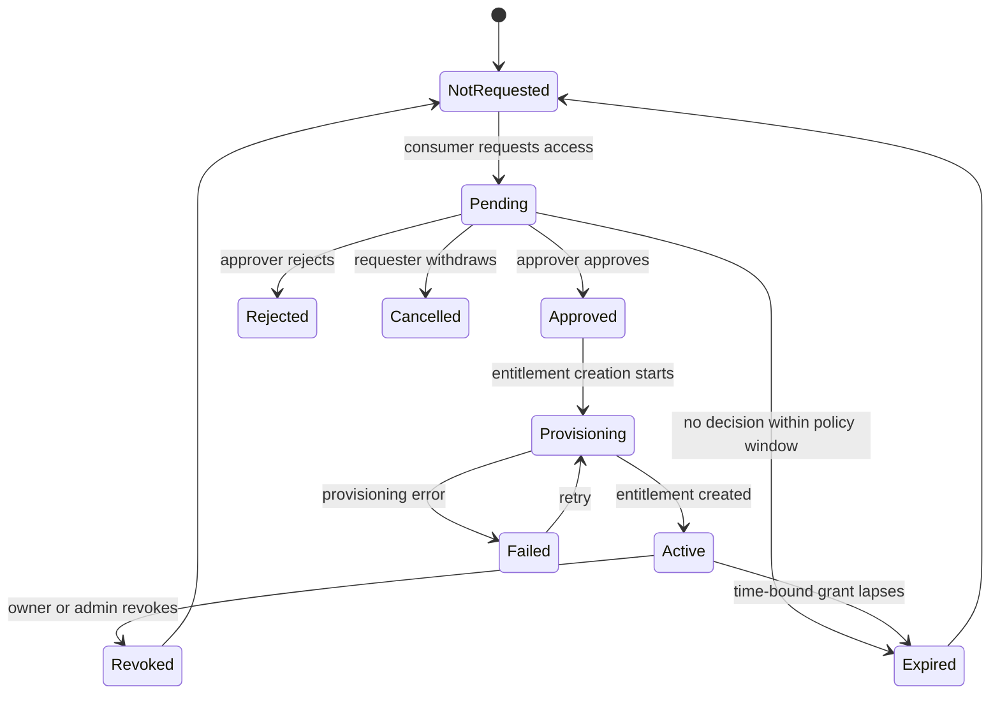
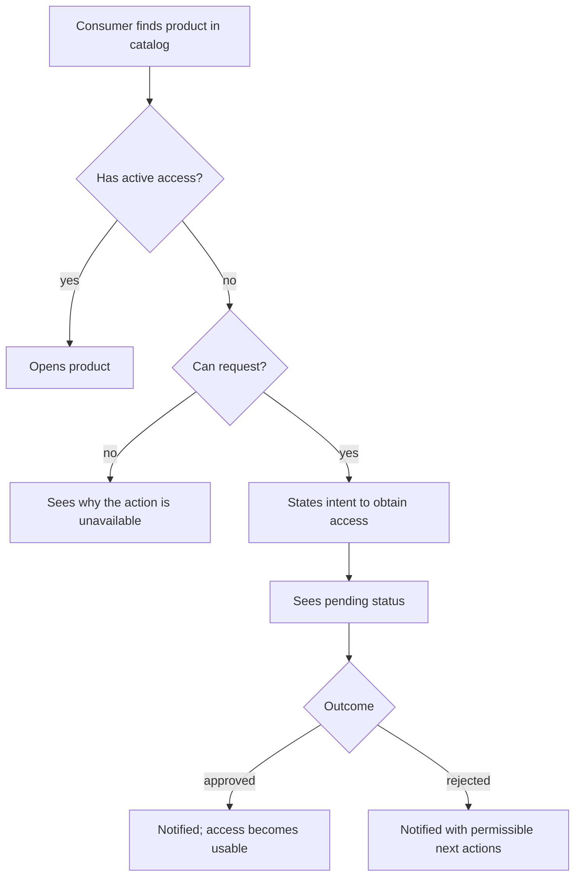
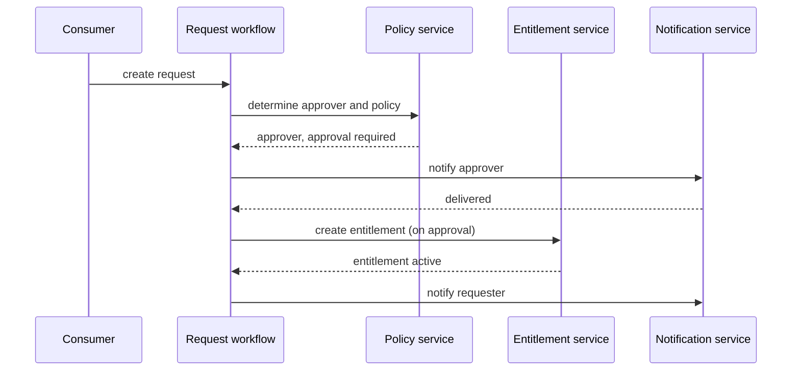

# Diagrams (REQ-§34)

Use text-native diagrams whenever they improve understanding. Prefer Mermaid
so outputs stay versionable, diffable, editable, and readable by both humans
and AI systems.

A diagram **supplements** prose; it never replaces it. A state that appears
only in a Mermaid block and not in the EIS-§8 per-state table is undocumented.

## Which diagram where

| EIS section | Diagram | Mermaid type |
|---|---|---|
| §8 State Models | Object lifecycle, one per object | `stateDiagram-v2` |
| §10 User Journeys | The user's path to a goal | `flowchart TD` |
| §11 Business / System Workflows | The system's path, multi-party | `sequenceDiagram` |
| §12 Service Blueprint | Stage × layer grid | Markdown table (below) |
| §13 Interaction Scenarios | Only when a branch set is hard to read as prose | `flowchart TD` |

## State model



Every node must be a state named in the EIS-§8 table for that object, and
every edge label must be an event the specification defines. Do not model only
the happy path — `pending`, `loading`, `processing`, `partial success`,
`failure`, `retry`, `cancellation`, `expiration`, `revocation`, `stale state`,
`concurrent modification`, `duplicate actions`, `resource deletion`, and
`permission loss` all deserve consideration.

## User journey



Nodes are user-observable steps and decisions. A node must never name a
screen, a control, or a component.

## Business / system workflow

Keep this **separate** from the journey above — never conflate what the user
experiences with what happens behind the scenes (REQ-§14).



## Service blueprint (EIS-§12)

A stage × layer table, not a Mermaid diagram (REQ-§15):

| Stage | Discover | Request | Approval | Provision | Use |
|---|---|---|---|---|---|
| User | Finds product | Requests access | Waits | Receives update | Opens product |
| Frontstage | Product details | Request accepted | Pending status | Access ready | Product available |
| Backstage | Eligibility check | Request creation | Policy evaluation | Entitlement creation | Authorization |
| Systems | Catalog | Workflow | IAM | Resource service | Resource |

The four row labels — `User`, `Frontstage`, `Backstage`, `Systems` — are
fixed. Columns are the real stages of this feature.

Use a blueprint when the experience has meaningful backend workflow, multiple
systems, or asynchronous operations. For a trivial interaction, EIS-§12's body
reads `Not applicable — <reason>` (see `eis-skeleton.md`).

## Syntax hygiene

- Fence with ```` ```mermaid ````.
- Quote any label containing `(`, `)`, `:`, `,` or `-` — `A["Request (pending)"]`.
- No HTML, no styling directives, no click handlers.
- Keep a diagram under roughly 20 nodes; split by object or by journey instead
  of growing one unreadable graph.
